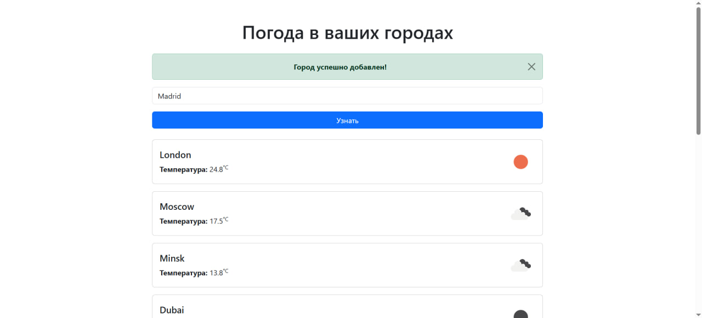
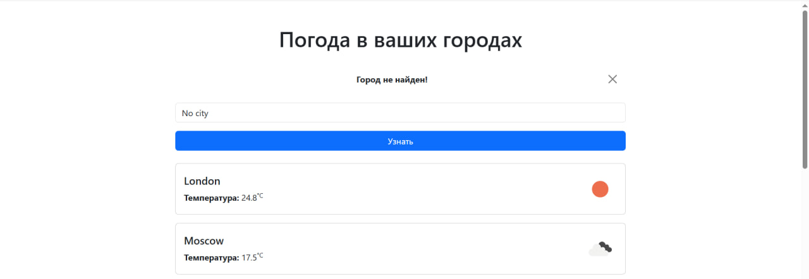

# Cервис weather

[](https://www.python.org/)
[](https://www.djangoproject.com/)
[](https://sqlite.org/)
[](https://www.docker.com/)
[](https://html.com/)
[](https://jinja.palletsprojects.com/en/stable/)

# Описание 

🌤Данный проект представляет собой веб-приложение, которое позволяет пользователям узнавать текущую погоду в интересующих их городах. Благодаря интеграции с API OpenWeather, система автоматически получает актуальные метеоданные, включая температуру и погодные условия. Пользователь может ввести название города, сохранить его в базе данных и моментально получить сводку погоды с наглядной иконкой. Если город введен неправильно, он не будет добавлен в базу данных и пользователю выведется сообщение об ошибке. Это интуитивное и простое решение для тех, кто хочет следить за погодой в разных уголках мира. Проект поддерживает как локальное развертывание, так и и развертывание в Docker-контейнерах. 




# Локальный запуск проекта 

- Склонировать репозиторий:

```bash
   git clone <ссылка на репозиторий>
```

- Установить зависимости из файла requirements.txt:

```bash
   pip install -r requirements.txt
```

- Создать файл .env по образцу:
```bash
   OPENWEATHER_API_KEY=*****
   SECRET_KEY=**************
```

- Создать миграции:
```bash
   python manage.py makemigrations
```

- Выполнить миграции:
```bash
   python manage.py migrate
```

- Запустить проект:
```bash
   python manage.py runserver
```

# Запуск проекта через Docker

- Собрать образ из Dockerfile:
```bash
   docker build -t weather .
```

- Запустить контейнер:
```bash
   docker run -p 8000:8000 weather
```

#### Автор

Куприянов Т.А. - [https://github.com/tims1de](https://github.com/tims1de)
